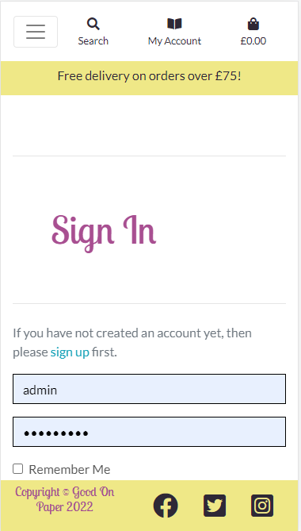

# Good On Paper
Portfolio Project 5 Full Stack Toolkit - Code Institute
Find the app [here](https://mm483-good-on-paper.herokuapp.com/)

# About
Good On Paper is a fictional online book store that sells a range of genres based on data from [goodreads](https://www.goodreads.com/). It is a simple site allowing users to select books my genre, sort by price or rating and purchase them. 

# User Experience

## Business Goals

Good On Paper is a (fictional) online retail bookstore that sells a range of genres of books. The goal of building this site is to:
- provide a trustworthy place to order books
- to build brand awareness through marketing that links to the site as well as consistent use of colours, fonts, logos and imagery.
- to generate a good base of newsletter subscriptions
- to keep track of sales

## User Goals

This site will be used by both business staff and customers and therefore needs to consider both perspectives.

From a business staff perspective, the site needs to:
 - Be able to add new stock to the site
 - Be able to edit stock on the site
 - Be able to delete stock from the site
 - Be able to manage accounts
 - Be able to review orders
 - Be able to accept payments
 - Be able to send newsletters to customers
 - Keep track of book stock

From a customer perspective, the site needs to:
- Be easy to navigate
- Allow books to be sorted by price or rating
- Show books and their detail (e.g. title, author, price, description, book cover)
- Allow order placement
- Allow orders to be reviewed

A number of features are required to carry out these needs and these will be discussed throughout this README.

## User Stories
This project has been tracked using [GitHub Projects](https://github.com/mmoore483/good-on-paper/projects/1) which contains all the current user stories.

## Structure

<strong>Home Page - Wireframe</strong>

The home page will be responsive with the top menu dropping into a hamburger icon on smaller screen sizes as well as a sticky nav bar to ensure the user can easily navigate the site. The Home page will also have a background image that will be used elsewhere to market the book store. There will be a call-to-action button taking the user to browse all products or they can search by category in the navbar menu. The navbar and a footer (containing social media links, privacy policy etc.) will be available across all pages in a uniform fashion for a cohesive experience. There will also be an advertising banner which, for now, will mention delivery but in future may advertise specific sales or new ranges in stock. Clicking on the logo on any page will return the user to the home page. The shopping cart with price will automatically update as users add items to their bag.

<strong> Home Page - As Deployed </strong>

Points of difference from intended wireframe: 
- The logo, instead of an image is now text of the business name. 
- The category names were defined as several of the genres of books deemed the most common searched. 
- Each of the categories also has a drop down allowing the user to search via price or rating. 
- The Mailing List menu items takes the user to a sign up form as mentioned below. 
- Rather than sign up/log in, there is a book icon titled My Account which contains a drop down to sign up/log in if not authenticated or if authenticated, to view order history (mentioned below) or logout. 

<strong>Sign In/ Sign Out/ Sign Up AllAuth Forms - As Deployed</strong>

Account creation was intended to be done with simple AllAuth forms thus no specific wireframe was created for them. In future, these could be further styled for a more enjoyable experience although they are completely functional. 

<strong>Books (All products page) - Wireframe</strong>

In keeping with the rest of the site, the navbar/menu and footer are consistent. The page content will include rows and columns of books in a grid like format that will react responsively, decreasing the number of columns as screen size decreases. Underneath each image of a book cover (the rectangles depicted in the wireframe) will be the book details such as title, price, rating, author. Clicking on the book cover will take the user to the Book Details page. Where a book cover is not available, the Good On Paper Logo will be used instead. At the top of the page will be the option to search by different parameters. All aria-labels for book cover images will list the book title for screen readers.

<strong>Books (All products page) - Deployed</strong>

Parameters chosen for searching are: price, rating, title, author. There are no points of deviation from the original wireframe.   

<strong>Book Details - Wireframe</strong>
Again, the top nav/menu and footer will remain the same. The book details will be displayed with the book cover image and book details as shown previously however, this time, it will also contain the book description (or blurb) as further details. The user will also be able to define a quantity and it to the bag or return to browsing the books. Where no book cover image is available, the Good On Paper Logo will be used. 

<strong>Book Details - Deployed</strong>
For mobile, the book cover image is reduced and the details are stacked upon one another as shown below. Otherwise, there are no points of difference from the original wireframe.

<strong>Bag - Wireframe</strong>

Clicking on the shopping cart in the top bar will take the user to the bag. This should be available on every page of the website. The bag page will contain a summary of items added to the bag including the title, quantity and price. The delivery cost and grand total are also included so the customer knows what they're letting themselves in for prior to purchase. The customer can then place their order.

<strong>Bag - Deployed</strong>

An element lacking from the wireframe is the ability to adjust the bag at this point. The final layout chosen allows for updating quantities or removing items. The user is also given an option to return the shop for further browsing or can use the navbar to find the page of interest. Again, responsiveness is achieved by stacking elements when on small screens as demonstrated in the images below. 

<strong>Checkout - Wireframe</strong>

The checkout page will contain a brief bag summary so that the customer knows what they are purchasing and there will be a back button allowing them to return to the bag to make adjustments should they need to. Then, the page needs to essentially be a form containing all the elements required for accepting payment and eventually posting the book e.g. Name, Address, Number, Card Number etc. There will be a check box to save the details for next time (much alike other e-commerce sites) and then the complete order button to submit the order. This is intended to be connected to stripe and upon success, return the customer to a success page. 

<strong>Checkout - Deployed</strong>

All of the wireframe features were included however the layout does look slightly different. There is also an option to create an account or sign in in order to save the details. Responsiveness is achieved by stacking elements as shown in the images below.

<strong>Newsletter Creation - Wireframe</strong>

This page is to create a simple email newsletter to those that have signed up to the mailing list. This page will only be accessible to administrators/business users and not the customer. It is a simple form and upon the pressing of create, will send the email out. 

<strong>Newsletter Creation - Deployed</strong>

In retrospect, this feature would have been best implemented using a third party so that newsletter design could be prettier and more effective. However, it does look exactly as planned. 

<strong>Mailing List Sign Up - Wireframe</strong>

For the mailing list sign up, the user can enter their email and optionally their name (for personalised emails), press the signed up check box and submit themselves to the list. In order to unsubscribe they should return to this page, enter their email and uncheck the box before pressing submit. Generally, it's an extremely simple form without much flare.

<strong>Mailing List Sign Up - Deployed</strong>

The deployed version of the form looks exactly like the wireframe mock up. Along with newsletter creation, this could have been achieved implementing a third party that could assist with mail lists like mailchimp and in future, the site will transition to that. The check button is ticked by default for ease of sign up. 

<strong>Order History - Wireframe</strong>

The Order History is intended to be a table of past orders that the customer can review in their account. This is only accessible if they've made an account. The table should auto-fill as soon as a new order is made and in the future, we could also integrate status in an extra column e.g. place, out for delivery, delivered.

<strong>Order History - Deployed</strong>

The deployed version is very much akin to the wireframe and in future, the issue of product status should be integrated to complete further user stories. 

### Databases

The databases required to handle the planned functionality include: products, orders, user profiles, mailing list, newsletters. Not all of the databases are related e.g. the mailing list is currently handled separately to the user profiles however in future, perhaps can be integrated.

<strong>Book</strong>

Purpose: To store all the product data of the books/product for sale with most field names are taken from the headings in the original data file.
| Field Name | Field Type| Validation|
--- | --- | --
book_id | CharField|max_length=254, null=False, blank=False|
title |CharField|max_length=254, null=False, blank=False|
series|CharField|max_length=254, null=True, blank=True|
author|CharField|max_length=254, null=True, blank=True|
description|TextField|
genres|CharField|max_length=254, null=True, blank=True|
image_url|URLField|max_length=1024, null=True, blank=True|
first_published_year|CharField|max_length=254, null=True, blank=True|
rating|DecimalField|max_digits=6, decimal_places=2, null=True, blank=True|
isbn|CharField|max_length=254, null=True, blank=True|
isbn13|CharField|max_length=254, null=True, blank=True|
price |DecimalField|max_digits=6, decimal_places=2, null=True, blank=False|

 

<strong>Order</strong>

Purpose: To accept the order so storage of details of the order and actual payment acception. It links to 
| Field Name | Field Type| Validation|
--- | --- | --
order_number|CharField|max_length=32, null=False, editable=False|
user_profile|ForeignKey|UserProfile, on_delete=models.SET_NULL, null=True,blank=True, related_name='orders'|
full_name|CharField|max_length=50, null=False, blank=False|
email|EmailField|max_length=254, null=False, blank=False|
phone_number|CharField|max_length=20, null=False, blank=False|
country|CountryField|blank_label='Country *', null=False, blank=False|
postcode|CharField|max_length=20, null=True, blank=True|
town_or_city|CharField|max_length=40, null=False, blank=False|
street_address1|CharField|max_length=80, null=False, blank=False|
street_address2|CharField|max_length=80, null=True, blank=True|
county|CharField|max_length=80, null=True, blank=True|
date|DateTimeField|auto_now_add=True|
delivery_cost|DecimalField|max_digits=6, decimal_places=2, null=False default=0|
order_total|DecimalField|max_digits=10, decimal_places=2, null=False, default=0|
grand_total|DecimalField|max_digits=10, decimal_places=2, null=False, default=0|
original_bag|TextField|null=False, blank=False, default=' '|
stripe_pid|CharField|max_length=254, null=False, blank=False, default=' '|

 

<strong>OrderLineItem</strong>

Purpose: To render the subtotal and order total properly in the checkout phase thus strongly links to both the order database and the book database as it collates information from both of them.
| Field Name | Field Type| Validation|
--- | --- | --
order|ForeignKey|Order, null=False, blank=False, on_delete=models.CASCADE, related_name='lineitems'|
book|ForeignKey|Book, null=False, blank=False, on_delete=models.CASCADE|
quantity|IntegerField|null=False, blank=False, default=0
lineitem_total|DecimalField|max_digits=6, decimal_places=2, null=False, blank=False, editable=False|

 

<strong>CreateNewsLetter</strong>

Purpose: to render and store a form used to create a newsletter that is then mailed out to recipients of the mail list.
| Field Name | Field Type| Validation|
--- | --- | --
subject|CharField|max_length=200, null=False, blank=False|
message|TextField||
image|ImageField|null=True, blank=True|
created_on|DateTimeField|auto_now_add=True|

 

<strong>SignUpLetter</strong>

Purpose: to allow people to sign up to the mailing list. The name field is optional and would allow for personalisation of the newsletters however is not compulsory.
| Field Name | Field Type| Validation|
--- | --- | --
email|EmailField|max_length=254, null=False, blank=False|
name|CharField|max_length=200, null=True, blank=True|
signed_up|BooleanField|default=True|

 

<strong>UserProfile</strong>

Purpose: To maintain default delivery information and order history.
| Field Name | Field Type| Validation|
--- | --- | --
user|OneToOneField|User, on_delete=models.CASCADE|
default_phone_number|CharField|max_length=20, null=True, blank=True|
default_street_address1|CharField|max_length=80, null=True, blank=True|
default_street_address2|CharField|max_length=80, null=True, blank=True|
default_town_or_city|CharField|max_length=40, null=True, blank=True|
default_county|CharField|max_length=80, null=True, blank=True|
default_postcode|CharField|max_length=20, null=True, blank=True|
default_country| CountryField|blank_label='Country', null=True, blank=True|

## Surface

### Style

A logo has been designed and used as the facebook page profile picture however still needs greater integration to the website. Colours for the rest of the site are based on the logo and depicted below along with a white and black shade for greater contrast and better user experience. In most cultures, yellow represents sunshine and happiness which is an emotion that I wish to call forth in potential customers visiting the site. Purple on the other hand is a much more controversial colour however to most people, it suggests luxury and nobility. The red-purple nature of this particular shade also feels warm and inviting which is a positive emotion for an online store. As shades of purple are one of the hardest colours for people to discriminate between, it has only been used with the white shade to ensure contrast is great enough for all potential users.

 

With regards to fonts, the cursive font of Lobster Two is to give a sense of mystery and olde-worlde feeling, something particularly in common with many of the books listed on the site, particularly with regards to genres like Fantasy, Historical Fiction, Romance etc.

The open sans font of Lato is easy to read and used for the majority of the site.

## Features

User Story names are taken from the [GitHub Project](https://github.com/mmoore483/good-on-paper/projects/1)

User Story | Ways in which met |
---|---|
Account Creation| An account can be created easily from the "my account" button featured on every page via the navbar. It is also accessible from the checkout page where you can sign in or sign up to save details for next time.|
Product Filtering| Product filtering is possible from the nav menu where books can be browsed in a different ways including by price, rating and in specific genres. Once the menu nav option has been selected, it is also possible to change the sort with the small dropdown box at the top of the book list. In this dropdown, there are futher options to sort including author and book title.|
Main Product Page| Books are displayed predominantly with their cover showing as this is what people would predominantly look at in traditional book stores. Who says you can't judge a book by it's cover? Where the cover is unavailable, the Good On Paper logo is displayed. Clicking on the book cover (the largest item displayed on the screen) will take you to the book detail page. Underneath the cover, the title, price and rating are displayed as these are deemed the most important details. For responsiveness, the number of columns that the books are displayed in, changes upon screen size.|
Site Navigation| The navbar features on every page allowing users to easily navigate the site. On smaller screens, the nav menu is available from a hamburger dropdown to allow for site content to take precedence. The search bar also becomes an icon button that will open to show a search bar upon selection. The navbar has a clickable font logo that returns the user to the home page. A user who is authenticated will have options to sign out or see their profile. If the user is a superuser, they will also have the option to create a newsletter. A user who is not authenticated will have options to sign up or sign in. |
Facebook Marketing|See images in the section below. A Facebook page was made however unpublished as this project is fictional. All details possible were added.|
Individual Product Page| The book detail page contains an extra description of the book e.g. the blurb, again replicating a key experience of a traditional book shop. Underneath the details, there is an option to adjust quantity and add the item to the back or return to the shop. This allows the user to go back without using the browser back buttons which is a nicer experience.|
Order Total | A running bag total is available next to the shopping cart icon on the far right of the nav bar.|
Create Stock| This user experience is not achieved directly through the site and must be navigated to by typing in /admin in the browser. This feature is to be improved in the future.|
Edit Stock| This user experience is not achieved directly through the site and must be navigated to by typing in /admin in the browser. This feature is to be improved in the future.|
Delete Stock| This user experience is not achieved directly through the site and must be navigated to by typing in /admin in the browser. This feature is to be improved in the future.|
Site Admin users | Administration of the site is achieved by manually typing /admin at the end of the website. In future, this would be manageable from the site directly.
Site Admin users | Administration of the site is achieved by manually typing /admin at the end of the website. In future, this would be manageable from the site directly.
Newsletter Sign Up| This is accessible via the nav bar mailing list option. It is separated from the user profile just in case someone is unsure about creating an account but would like to hear of new releases and offers. All that is required is an email address.|
Newsletter Unsubscribe| In order to unsubscribe, the mailing list is selected from the nav bar, the user then enters their email and unchecks the sign up box. Upon submission, the booleanfield will turn to false and they will no longer be emailed with newsletters.|
Newsletter| The creation of newsletters is a key marketing technique. It is possible to create and send emails to the mailing list if the user is a superuser. In future this should be managed by a third party for more aesthetically pleasing newsletters.|
Historical Order Review| If a profile is created, the order history is clearly shown in a table accessible from the my account dropdown menu and then selecting "My profile"|
Accept Payments| Stripe has been integrated into the site to allow for ease of payment. This is an advantage to both the user and business.|
Shopping Cart Creation| Once items are added to the bag, a small notification pops up in top right of the page and the cart will display the cost underneath it. Once items are added, the bag turns blue to signify that it has items in it and make it stand out against the other black icons to encourage the customer to click on it.|
SEO| A facebook mock up has been created. Meta keywords (comprised of the book genres) and a meta description have been added as well as a robots.txt file and sitemap.xml. Images also contain the book titles as alt text to aid with SEO.|
Contact Us Details| In the future, a contact us form or chat would be available to allow users to seek assistance if they are experiencing difficulty on the site.|
Order Status| In the future, the order history page would also show a status so the user can know when the item is shipped out to them. This might also allow the business to manage packaging of orders behind the scences|
Stock Keeping| In the future, the business would like to keep stock numbers within the site that automatically deduct sold books to avoid over-selling of items that are actually out of stock.|

Other Features | Advantages|
---|---|
Footer |The footer has social media links (although note, they currently just take the user to the social media site and Good On Paper does not have pages published as it is a fictional site). It contains the name of the business for continuity purposes.|
Banner|There is also a banner that presently shows how much needs to be spent for free delivery however could be used for other purposes in future.|
Colour Scheme|The main body of the site is white/light in colour with yellow for banner and footer and the purple colour for font in selected places. The rest of the font is black upon a white background for best contrast and user experience. 
Home Page |There is a background image that matches the facebook featured image for continuity. The image is light in colour and brings a calming feel to the site. It contains the image of a book which is the product the store is selling. There is a call-to-action button placed centrally over the image to encourage the customer to get browsing as soon as they enter the website.

### Facebook

## Testing

### User Story Testing
User stories have been commented on above

### Validator Testing
- HTML [W3C Validator](https://validator.w3.org/) No major errors, some relating to parent-child relationships and order of the tags used. e.g. a h3 inside a span.

- CSS [jigsaw validator](https://jigsaw.w3.org/css-validator/) No errors found on either base.css or the checkout.css file

- JS [JSHint Validator](https://jshint.com/) Was used on the stripe js file resulting in no errors.

- Pylint-django was used to validate python during the project. 

### Functional Testing

Testing is undertaken on a desktop on Chrome using the iPhone SE filter and then just normally on a 21" screen. Random testing is also carried out on microsoft edge due to time constraints - these tests are indicated by (E).

<strong>Manual Testing</strong>

Feature/Page| Test | Pass/Fail|
---|---|---|
Navbar| Clicked each link on nav bar to make sure it went to the correct place| Passed (E)|
Navbar| Observed on every opened page from the navbar that all elements, especially buttons, were clickable.| Failed: On the genre pages, the bottom row does not always display price and rating. Only an issue on larger than mobile/tablet screens (E)|
Footer| All social links open to the appropriate site in a new tab| Passed (E)|
Home Page| Call to action button shows all 100 books completely | Passed (E)|
Books Filtering| Try all the sorting filters: price, rating, book title, author | Passed|
Books Filtering| Try all the sorting filters: price, rating, book title, author | Passed|
Mailing List Sign Up| Used a temp mail to sign up, receive a successful message | Fail - written as a known bug|
Mailing List Sign Up| Used a temp mail to sign up, receive a successful email | Pass but badly formatted contents|
Mailing List Unsubscribe| Unsubsribe previous temp mail and receive a message saying unsubscribe is successful | Fail no message|
Mailing List Unsubscribe| Check admin to see if unsubscribed | Pass, email present but booleanfield set to false|
Create Account| Create account using temp email, look for successful message | Pass|
Create Account| Create account using temp email, look for email verification | Pass|
Create Account| Create account, ensure validation works with a short password | Pass|
Create Account| Create account using already signed up email and see if it rejects attempt | Pass|
Add Books| Add books to bag of different quantities and ensure titles, quantities and subtitles are correct and messages are working to say successfully added to bag | Pass (note, validation is on qty so a minimum of 1 book is added)|
Add Books| Try removing and updating quantities in the bag| Pass|
Add Books| Add 4 different titles to bag and ensure formatting is sufficient| Fail - adding more than 3 titles to the bag pushes the back to shop button off-screen on larger than mobile screens |
Add Books| Adding the same title two separate times (in one session) results in one entry in the bag with the quantity of two| Pass|
Checkout|Order summary is the same as the bag.| Pass |
Checkout|Attempt to use stripe with the 4242 code and see successful message| Pass |
Checkout|Attempt to use stripe with the 4242 code and see successful email| Fail - no email confirmation |
Checkout|Check the save details button on checkout and then try to purchase something else| Fail - checkout data did not fill by default |
Checkout|Adjust bag button works|Pass|
Bag|Bag turns blue when items are added|Pass|
Bag|Bag displays correct subtotal as items are added|Pass|
Bag|Bag displays correct subtotal as items are added|Pass|
Bag|Bag back to shop button works correctly|Pass|
My profile|Order history available|Pass but really badly formatted!|
My profile|A normal user cannot see the "create newsletter option" or navigate there using /newsletter/create with a returning message of "Sorry, only store owners can do that" |Pass|
My profile|A super user can see the "create newsletter option" and can navigate there using /newsletter/create|Pass|
Sign In|Form completely legible, success message, returned to home page|Pass|
Create Newsletter|Submit the form (ensure validation works) and recieve a success message|Fail|
Create Newsletter|Submit the form and see if the mailing list recipients receive it|Fail - all email addresses on the email list got the email regardless of whether the booleanfield was true|
Create Newsletter|Submit the form and see if it is the same in the admin|Pass|
Book Detail|All information legible|Pass|
Book Detail|Keep shopping button takes you back to previous sort settings|Fail - takes you back to all books|
Search Bar|Search bar looks at whole site for "Anne of green gables"|Fail - it only works if you're already looking at books e.g. if you were to use it on the bag, it fails.|
Admin|Check orders placed during testing appear in admin|Pass|
Admin|Can add books in admin (added book called Testing)|Pass(ish) - note the id needs to go up in increments e.g. 101 would be the next number. Perhaps ID should be an automated value|
Admin|Add a book with no image to check the default works|Fail|
Admin|Add a book and check the All Books total is now 101 |Pass|
Admin|Can edit book details in admin (added an image url to testing)|Pass|
Admin|Can delete books in admin (delete testing)|Pass|
Admin|Check deleted book url redirects to 404 |Pass|
Accounts|Check sign in, sign out forms are legible and give success/error messages as appropriate|Pass|

### Bugs
- Messages from the newsletter app do not display when they are expected to be triggered
- No order email confirmation
- Screen testing was done on a large 22" screen and the responsive iPhone SE filter but on my laptop screen which is about 16", the navbar looks massively oversized. This doesn't affect functionality but does make the site hard to use. This was caused by my mistake when checking responsiveness using chrome and inspect, it's important to remember the screen height is proportionally larger than the average screen. Most bugs were relating to styling so an overhaul on styling should be carried out!
- Emailing the newsletter recipients does not account for if they're subscribed or not - everyone gets the email.
- Keep shopping button returns to "All Books" rather than the filtered searching
- Searching only queries the page you're on rather than the books page or the whole site

# Deployment

### Create Application and Postgres DB on Heroku
- Log in to Heroku at https://heroku.com - create an account if needed.
- From the Heroku dashboard, click the Create new app button.  For a new account an icon will be visible on screen to allow you to Create an app, otherwise a link to this function is located under the New dropdown menu at the top right of the screen.
- On the Create New App page, enter a unique name for the application and select region.  Then click Create app.
- On the Application Configuration page for the new app, click on the Resources tab.
- In the Add-ons search bar enter "Postgres" and select "Heroku Postgres" from the list - click the "Submit Order Form" button on the pop-up dialog.
- Next, click on Settings on the Application Configuration page and click on the "Reveal Config Vars" button - check the DATABASE_URL has been automatically set up. 
- A number of other Config Var needs to be assigned:

| Key | Value |
--- | ---
AWS_ACCESS_KEY_ID | `<your secret key>`
AWS_SECRET_ACCESS_KEY | `<your secret key>`
DATABASE_URL | `<your postgres database url>`
EMAIL_HOST | `<stmp.gmail.com>`
EMAIL_HOST_PASSWORD | `<your gmail generated password for third party apps>`
EMAIL_HOST_USER | `<your gmail address>`
SECRET_KEY | `<your secret key>`
STRIPE_PUBLIC_KEY | `<your publishable key>`
STRIPE_SECRET_KEY | `<your secret key>`
STRIPE_WH_SECRET | `<your secret key>`
- Add a new Config Var called DISABLE_COLLECTSTATIC and assign it a value of 1.
- Add a new Config Var called SECRET_KEY and assign it a value - any random string of letters, digits and symbols.
- The settings.py file should be updated to use the DATABASE_URL and SECRET_KEY environment variable values as follows:

  - DATABASES = {'default': dj_database_url.parse(os.environ.get('DATABASE_URL'))}

  - SECRET_KEY = os.environ.get('SECRET_KEY')

- In Gitpod, in the project terminal window, to initialize the data model in the postgres database, run the command python3 manage.py migrate 
- Make sure the project requirements.txt file is up to date with all necessary supporting files by entering the command pip3 freeze --local > requirements.txt
- Commit and push any local changes to GitHub.
- In order to be able to run the application on localhost, add SECRET_KEY and DATABASE_URL and their values to env.py or gitpod variables.
- At present, GitHub and Heroku are not linking correctly so in the terminal login to Heroku using Heroku login -i and your usual email and password
- Then remote in using heroku git:remote -a `<heroku app name>`
- Then push code to heroku. Migrate the files and load the fixtures to populate the database
- create the superuser account in your new database

## Forking

To trial changes to the site without affecting the original, the GitHub Repository can be forked.

- Log into GitHub and locate the desired repository
- In the top right, click the Fork button.

## Cloning

[Cloning](https://docs.github.com/en/github/creating-cloning-and-archiving-repositories/cloning-a-repository-from-github/cloning-a-repository) is useful for a multitude of reasons: to contribute to a project, to trial changes, to fix merge conflicts, add or remove files, and push larger commits.

- Log into your GitHub then find the gitpod repository
- Click the Code button
- If cloning with HTTPS, click the clipboard icon to copy the link
- Open Gitbash
- Change the current working directory to the location where you want the cloned directory to be.
- Type git clone, and then paste the URL you copied earlier.
- Press enter to create your local clone

# Credits

-  <strong>Checkout and Profile apps and the bag_tools were from the Code Institute Boutique Ado Walkthrough.</strong> 

Generally, that walkthrough was very much the inspiration for this project. In all honestly, I found it particularly difficult to adjust them in a way that would still make sense for an e-commerce application also selling physical products. Essentially, they were as good as my imagination could take me. Therefore, I tried to show skills by implementing other features and by rendering information differently. 

- Book store name <strong>Good On Paper</strong> was randomly generated using a [fantasy name generator](https://www.fantasynamegenerators.com/bookstore-names.php) and it felt apt for where I am at the time of doing this course! I'm disappointed with the amount of effort I was physically/mentally able to give this course and so the idea of doing it was...good on paper. Despite that, I would thoroughly recommend this course to anyone interested in software development for e-commerce applications or gaining the transferable programming skills. 

- The logo (which I realise now, is not physically shown anywhere on the site except if the book cover doesn't exist) was generated using [freelogodesign.org](https://www.freelogodesign.org/).
- The purple and yellow colours are from the logo and were used in conjunction with coolors.co for the black selection
- The dataset was taken from [data world](https://data.world/yansian/top-100-young-adult-fiction/workspace/file?filename=goodreads_Top100_YoungAdultFiction.csv) and was adjusted to add random prices between £10 and £20. It was manually adjusted as well as adjusted with a json formatter.
- The background image used on the site and as the facebook banner was by [Sincerely Media on unsplash.com](https://unsplash.com/photos/_-hjiem5TqI?utm_source=unsplash&utm_medium=referral&utm_content=creditShareLink)
- A number of technologies and tools were used to generate the site including font-awesome, bootstrap 4, bootstrap themes, allauth, AWS S3 bucket, django, django storages, django heroku, psycopg2, github, git, gunicorn, Boto3, Django crispy forms, Stripe, gitpod, balsamiq, JQuery, google fonts, Pillow, gmail